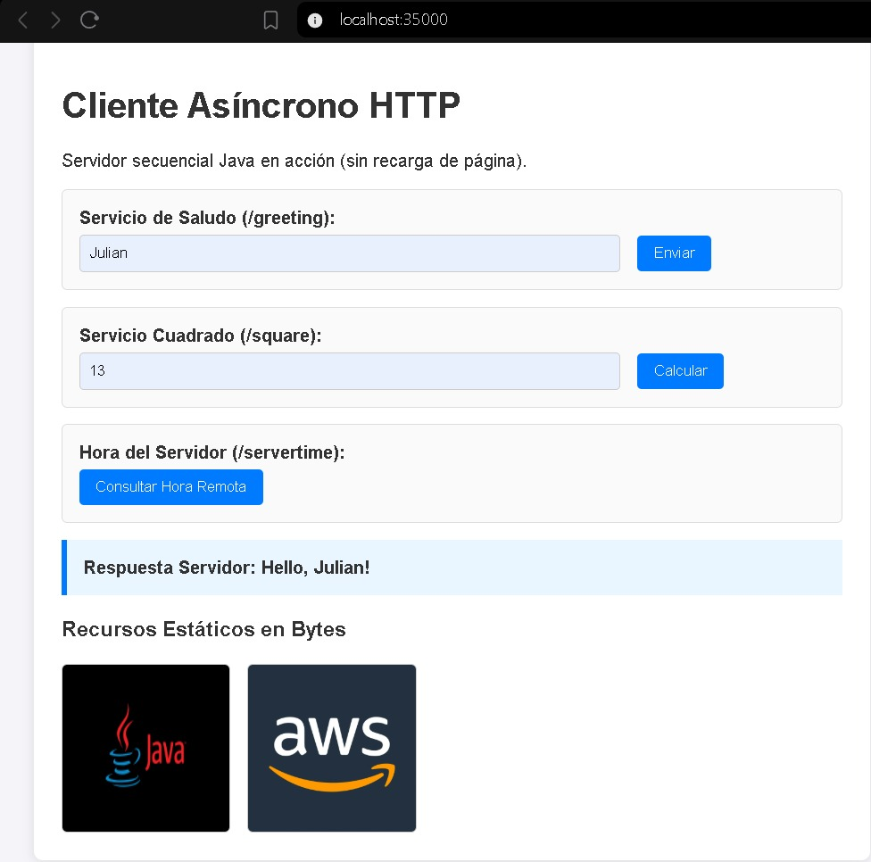
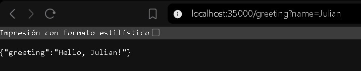
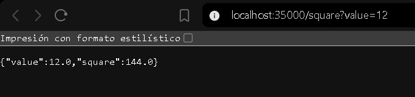
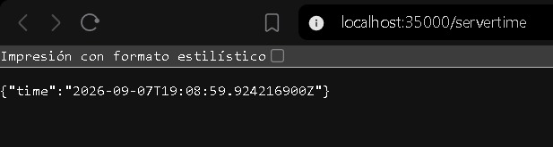
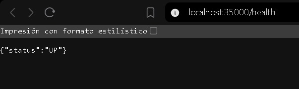
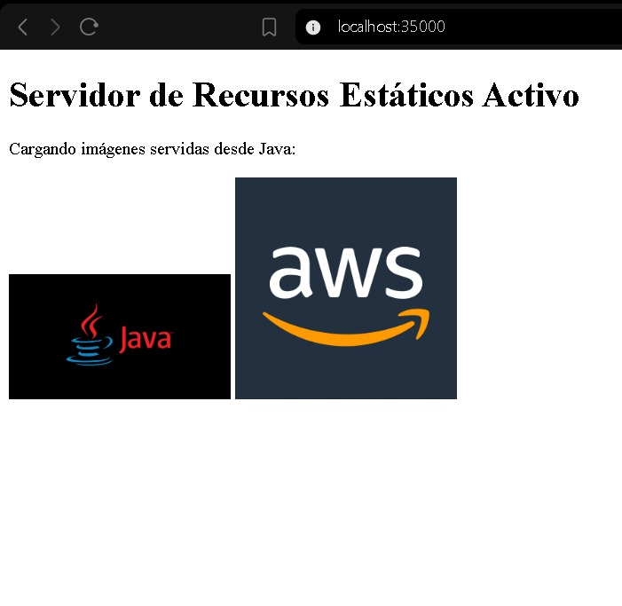
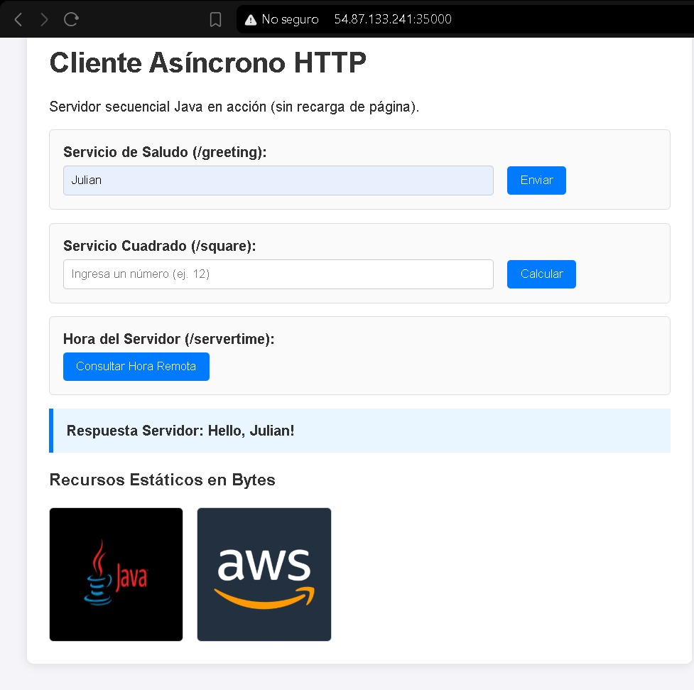

# Networking: Lab 5 – From a Minimal HTTP Server to a Web Application on AWS

- Author: Julián Ramírez

- Course: Enterprise Architecture – Escuela Colombiana de Ingeniería Julio Garavito
AWS EC2 Deployment: [http://54.87.133.241:35000/](http://54.87.133.241:35000/)

---

## 1. Project Description

This lab covers the transition from a minimal, single-threaded HTTP socket server to a complete stateless mini web application. The server is built in pure Java (no frameworks or external routing libraries) and is capable of:

- Serving static resources (HTML files, JavaScript, and PNG/JPEG images) read strictly as bytes.
- Exposing dynamic REST endpoints in JSON format through explicit conditional routing.
- Providing a reactive front-end experience using asynchronous browser calls (`Fetch API`), avoiding full page reloads.
- Being deployed remotely and independently on an AWS EC2 instance.

The main goal is to expose the baseline behavior of a sequential server (handling one connection at a time) in order to understand why client-side asynchrony does **not** equate to server-side concurrency.

---

## 2. System Metaphor and Architecture

### System Metaphor: "The Single-Teller Bank Window"

The server behaves like a bank counter with a single teller (sequential server). Even though customers may have mobile apps on their smartphones (an asynchronous JavaScript client) that let them check information and fill out forms without physically standing in line, the teller at the window can still only handle one transaction at a time. If a request requires slow processing, every other request patiently piles up in the window's waiting line (the TCP socket queue).

### Architecture Diagram

```text
┌───────────────────────────┐
│   Web Browser (Client)    │
│   HTML5 + JS (Fetch API)  │
└─────────────┬─────────────┘
              │ HTTP GET (Port 35000)
              ▼
┌───────────────────────────┐
│ AWS EC2 Security Group    │
│ Custom TCP 35000 / SSH 22 │
└─────────────┬─────────────┘
              │
              ▼
┌────────────────────────────────────────────────────────┐
│ Sequential Java Server (HttpServer.java)                │
│ Connection loop: Accept -> Handle -> Close Socket       │
├───────────────────────────┬────────────────────────────┤
│   Static Resources        │     REST JSON Services      │
│   (public/*.html, png,    │     (/greeting, /square,    │
│    jpg, script.js)        │      /servertime, /health)  │
└───────────────────────────┴────────────────────────────┘
```

The browser makes asynchronous HTTP/1.1 requests from the web client. Requests pass through the AWS security group firewall on port 35000 and reach the EC2 virtual machine. There, the Java server receives the connection in a sequential loop (`serverSocket.accept()`), determines whether the path corresponds to a static resource on the classpath or to a hardcoded service, builds the appropriate HTTP response, and closes the client socket before moving on to the next request.

---

## 3. Design Decisions

- **Explicit Sequential Server:** A single-threaded, sequentially processed architecture was intentionally kept in order to observe, in a controlled way, the server's capacity limits before introducing concurrency.
- **Byte-Level Resource Reading:** All resources (text and images) are read uniformly via `InputStream` and transmitted through `OutputStream` as byte arrays (`byte[]`). This prevents binary corruption of JPEG/PNG images.
- **Security and Path Traversal Protection:** URIs are sanitized using the `java.net.URI` class, and any relative navigation attempt is blocked by inspecting `..` characters, returning a `403 Forbidden` response.
- **Decoupled Error Handling:** A failure or malformed request from one client does not crash or halt the server's main loop, ensuring continuous availability.
- **Reactive Client:** `e.preventDefault()` is used on form interactions together with the asynchronous `Fetch API`, so only the relevant result/error areas of the DOM are updated.

---

## 4. Project Structure

The project follows Maven's standard directory convention:

```text
networking-lab2/
├── .gitignore
├── pom.xml
└── src/
    ├── main/
    │   ├── java/
    │   │   └── com/
    │   │       └── escuelaing/
    │   │           └── edu/
    │   │               └── app/
    │   │                   └── HttpServer.java
    │   └── resources/
    │       └── public/
    │           ├── index.html
    │           ├── script.js
    │           ├── image1.png
    │           └── image2.jpg
    └── test/
        └── java/
```

---

## 5. Prerequisites

- **Java Development Kit (JDK):** Version 17 or higher (developed and validated on Microsoft Build of OpenJDK 21).
- **Apache Maven:** Version 3.8+.
- **Web Browser:** Compatible with HTML5 and ES6 (Chrome, Brave, Firefox, Edge).

---

## 6. Local Installation and Build

1. Clone the GitHub repository.
2. Clean and package the project with Maven (this generates an executable Fat-JAR):
   ```bash
   mvn clean package
   ```
3. Verify that the executable `networking-lab2-1.0-SNAPSHOT.jar` was created inside the `target/` directory.

---

## 7. Local Execution

1. Start the compiled server:
   ```bash
   java -jar target/networking-lab2-1.0-SNAPSHOT.jar
   ```
2. Open the application in your browser at: `http://localhost:35000/`
3. To use a different port locally, set the environment variable:
   ```bash
   PORT=8080 java -jar target/networking-lab2-1.0-SNAPSHOT.jar
   ```

---

## 8. App Usage and Exposed Services

| Service / Resource | Type      | Method | Input / Parameter        | Usage Example              | Expected Response |
|---------------------|-----------|--------|---------------------------|-----------------------------|--------------------|
| Home Page           | Static    | GET    | None                       | `/` or `/index.html`       | Structured HTML document with images and script |
| JS/IMG Resources    | Static    | GET    | None                       | `/script.js`, `/image1.png`| Binary/text file served with correct `Content-Type` |
| Greeting            | REST JSON | GET    | `name` (Query String)      | `/greeting?name=Julian`    | `{"greeting":"Hello, Julian"}` |
| Square              | REST JSON | GET    | `value` (Number)           | `/square?value=12`         | `{"value":12.0,"square":144.0}` |
| Servertime          | REST JSON | GET    | None                       | `/servertime`               | `{"time":"2026-09-07T18:30:00Z"}` |
| Health              | REST JSON | GET    | None                       | `/health`                   | `{"status":"UP"}` |

### Controlled Error Testing

- **Invalid input on a service:** `/square?value=abc` → returns HTTP `400 Bad Request`.
- **Nonexistent file:** `/desconocido.html` → returns HTTP `404 Not Found`.
- **Path Traversal:** `/../pom.xml` → returns HTTP `403 Forbidden`.

---

## 9. AWS EC2 Deployment

1. **Instance:** Amazon Linux 2023 (`t2.micro`).
2. **Security Group:**
    - Port `22` (SSH) allowed for remote administration.
    - Port `35000` (Custom TCP) open for application web traffic.
3. **Artifact Transfer:**
   ```bash
   scp -i "labsuser.pem" target/networking-lab2-1.0-SNAPSHOT.jar ec2-user@54.87.133.241:~/app.jar
   ```
4. **Persistent Execution After Logout:** The process was started in the background using:
   ```bash
   PORT=35000 nohup java -jar app.jar > server.log 2>&1 &
   ```

---

## 10. Discussion and Reflection Questions

**1. Why does a single HTML page trigger multiple HTTP requests?**
Because the HTML page declares references to external dependencies (`.js` scripts, `.png`/`.jpg` images, stylesheets). The browser parses the DOM and issues independent HTTP requests for each resource.

**2. Why must image responses be treated as bytes?**
Because images contain binary pixel-decoding data. Treating them as characters or text alters their internal encoding (such as UTF-8), corrupting the image.

**3. What is the role of `Content-Type`?**
It tells the browser the nature of the delivered resource (MIME type) so it knows how to process it (e.g., render HTML, execute JavaScript, or paint an image).

**4. What is hardcoded in this design, and what would a framework generalize?**
The routing conditional blocks (`if/else`) were explicitly coded. A framework generalizes class reflection, dependency injection, and route mapping through annotations (e.g., `@GetMapping`).

**5. Why can the browser remain interactive while the server handles requests sequentially?**
Because the `Fetch API` executes requests in the background asynchronously within the browser. However, if two requests arrive almost simultaneously, the second one is blocked in the server's TCP queue until the first one finishes being processed.

**6. What changed when the server was moved to EC2, and what didn't?**
The execution host, the physical infrastructure, and the public IP changed. The executable code, the event loop logic, and the application's sequential behavior did not change.

**7. What happens when two users send slow requests at the same time?**
The second user's request stops and waits in the operating system's socket queue until the first user's socket is processed and closed.

**8. What is the next architectural limit to solve?**
Server-side concurrency, by implementing a Thread Pool to process multiple requests in parallel threads, before scaling to load balancers or multiple instances.

---

## 11. Evidence of Operation

- Local Execution: Server running on `localhost:35000` responding to sequential requests.



- JSON Services: Validation of the `/greeting`, `/square`, `/servertime`, and `/health` endpoints with structured JSON responses.









- Static Resources: Successful loading of PNG/JPG images read as bytes on the client.



- AWS EC2 Deployment: Application active and publicly accessible at `http://54.87.133.241:35000/`.



---

## 12. Known Limitations

- The server is purely sequential (handles only one TCP connection at a time).
- It is not designed for high-demand production environments.
- It supports only the `GET` HTTP method.

---

## 13. Author and Acknowledgments

- Author: Julián Ramírez
- Acknowledgments: Escuela Colombiana de Ingeniería Julio Garavito and the official AWS EC2 / Java OpenJDK documentation.
